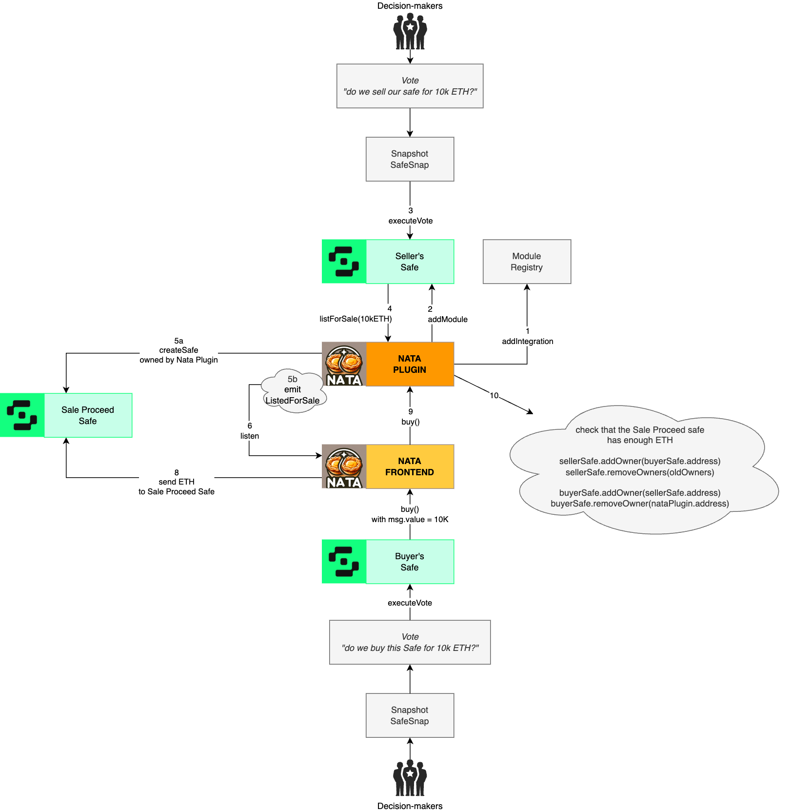

# NATA

## Content

This is the main repository for Nata Finance.

- [web/](./web/) contains the Nata frontend to interact with Safe, IExec Web3mail and WalletConnect Web3Inbox.
- [contracts/](./contracts/) contains the NataPlugin for Safe.

## Deployments

### Frontend

**https://nata.vercel.app✨**

[Example inside the Safe App](https://app.safe.global/apps/open?safe=gor:0x032487513ba6b20Cd154e682A33fCDd6A7E88291&appUrl=https%3A%2F%2Fnata.vercel.app)

### NataPlugin for Safe

| Network | Address |
| --- | --- |
| **Goerli** | [0x9A92928604331E9fBDF5390A134c5fC20DAd3943](https://goerli.etherscan.io/address/0x9A92928604331E9fBDF5390A134c5fC20DAd3943) |
| **Gnosis** | [0x9A92928604331E9fBDF5390A134c5fC20DAd3943](https://gnosisscan.io/address/0x9A92928604331E9fBDF5390A134c5fC20DAd3943) |

## Interactions Overview
